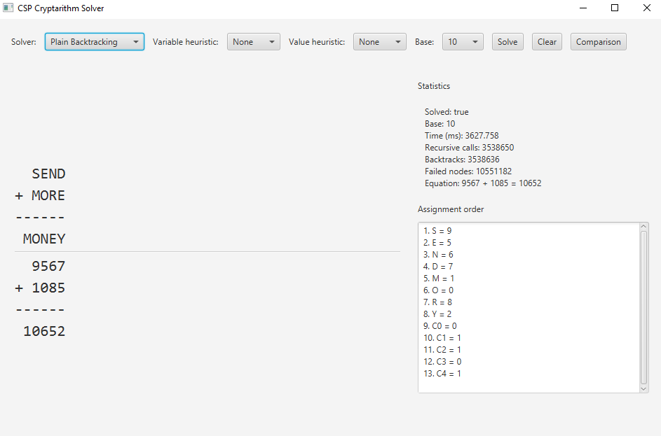
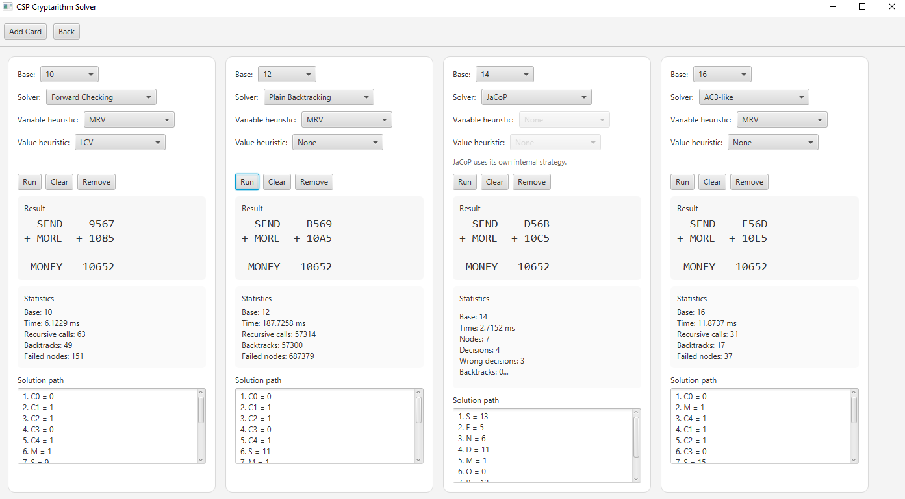

# CSPSolver

CSPSolver je desktopová aplikácia na riešenie kryptaritmetickej úlohy `SEND + MORE = MONEY` ktorej hlavné využitie je skúšanie rôznych kombinácii solverov, heuristík a číselných sústav cez grafické rozhranie.

## Čo Aplikácia Umožňuje

Program umožňuje:

- riešiť `SEND + MORE = MONEY` v číselných sústavách od `8` do `28`
- zvoliť si rôzne kombináciu heuristík a solverov
- zobraziť výsledné poradie priradenia hodnôt písmenám
- sledovať štatistiky riešenia
- porovnávať viac konfigurácií vedľa seba

<p align="center">
  
</p>

## Implementované Solvery

V aplikácii sú implementované tieto metódy riešenia:

- Základný Backtracking
- Forward Checking
- AC3 propagácia
- JaCoP solver (ako externý solver)

## Implementované Heuristiky

Aplikácia podporuje:

- `MRV` pre výber premennej
- `LCV` pre usporiadanie hodnôt

Ak nie je zvolená žiadna heuristika, solver použije poradie v akom boli premenné zadefinované poradie.

## GUI

Pri spustení aplikácia zobrazuje:

- vyriešený kryptaritmus
- čas výpočtu
- počet rekurzívnych volaní
- počet backtrackov
- počet neúspešných uzlov
- poradie priraďovania jednotlivých premenných

Porovnávací režim umožňuje spúšťať viac kombinácií solverov a heuristík vedľa seba.

<p align="center">
  
</p>

## Spustiteľná Verzia

Súčasťou repozitára je aj .exe súbor z ktorého je aplikáciu možné spustiť.

- `Release.zip` obsahuje pripravenú verziu pre Windows
- priečinok `jre/` musí zostať vedľa `CSPSolver.exe` obsahuje jdk aby bol súbor spustiteľný aj na počítačoch bez nainštalovanej Javy
- aplikáciu je možné spustiť aj z IDE cez triedu `sk.ukf.gui.MainApp`, a `sk.ukf.app.Main` pre konzolovú verziu

## Štruktúra Projektu

```text
src/main/java/
  sk/ukf/app/         Konzolový vstupný bod
  sk/ukf/gui/         JavaFX aplikácia
  sk/ukf/model/       CSP model a obmedzenia
  sk/ukf/solver/      Implementácie solverov
  sk/ukf/heuristic/   Implementácie heuristík
```

## Použité Technológie

- Java
- Maven
- JavaFX
- JaCoP
